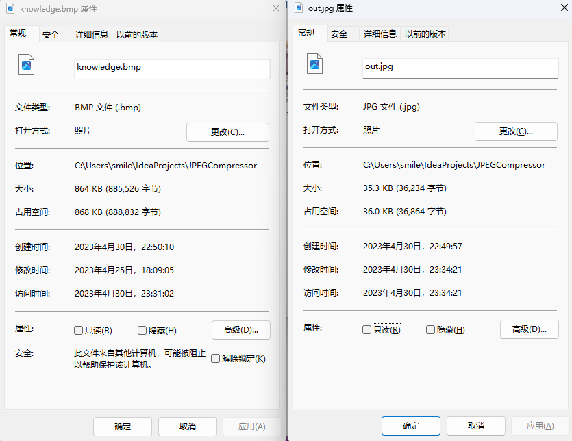
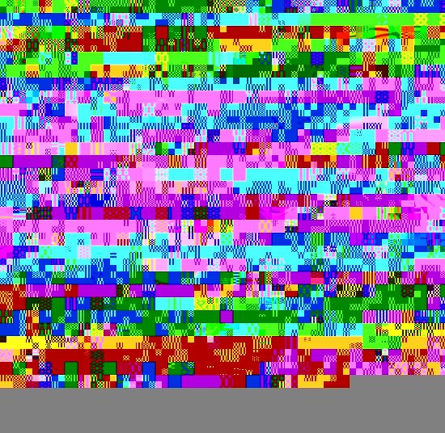

# JPEG Compressor
 
## 概述
一个基本由自己实现的**JPEG有损图像压缩编码器**，基于JFIF（JPEG文件交换格式）标准：
- 色彩空间转换（RGB 2 YUV）
- 色度抽样（采样因子4:2:0）
- MCU分块（16x16的最小编码单元，以Y1 Y2 Y3 Y4 U V的顺序写入比特流）
- DCT离散余弦变换
- 量化（基于50%压缩质量的亮度/色度量化表）
- 熵编码
    - 游程编码（RLE编码）
    - 可变长整数编码（VLI编码）
    - 范式霍夫曼编码（基于JPEG官方推荐的四张范式霍夫曼表）
- JPEG文件头构建及比特输出流写入

要注意的是，该项目并未完全实现JPEG编码器的全部功能，在这个项目中：
- 文件的读入和RGB色彩空间的读取仍然是基于ImageIO库来实现的
- 由范式霍夫曼表构建霍夫曼树参照了该项目目录下thirdparty/JpegEncoder.java的代码

此外：
- 本项目仅实现了JFIF标准要求的基本压缩算法，JPEG还支持许多其他的压缩算法（如熵编码部分还可以采用算术编码等）
- 本项目是基于SOF0（baseline基线式JPEG）的，此外还有一种SOF2（progressive渐进式JPEG）的编解码方式

## 展示
### 原图（knowledge.bmp）

### 输出图（out.jpg）

### 压缩比

## 详述
写完这个项目，感觉最难写的反而是熵编码部分，色彩空间转换、离散余弦变换、量化这三步在中文互联网上已经有足够详细的介绍了，也有现成的公式可以套用，但是分块（MCU）这一点很多资料都没有提及到，这直接关系到最后写入比特流时的编码顺序问题，而熵编码部分同样有大量细节没有阐述，这一步骤三种编码方式结合在一起而且压缩后的数据流过于抽象难以调试纠错。

看到中文互联网上的JPEG编码教程大多漏过了许多细节，打算写一篇尽可能详细的文章来帮助后人避免踩同样的坑。

本人会在日后写出baseline JPEG的详细过程

## 感谢
- 张艳. 基于FPGA的JPEG解码算法的研究与实现[D]. 南京理工大学, 2009.
- Wikipedia. JPEG codec example[EB/OL]. [2023]. https://en.wikipedia.org/wiki/JPEG.
- Wikipedia. 霍夫曼编码[EB/OL]. [2023]. https://zh.wikipedia.org/zh-hans/%E9%9C%8D%E5%A4%AB%E6%9B%BC%E7%BC%96%E7%A0%81.
- 黄兢成 . JPEG 中的范式哈夫曼编码[EB/OL]. [2023]. https://zhuanlan.zhihu.com/p/72044095.
- Tongtong. 写一个简易的 JPEG 解码器[EB/OL]. [2023]. https://www.mrchen.love/Article/ID/66.

## 黑历史
一些在熵编码步骤遇到的各种神必输出图

